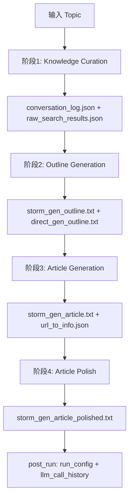
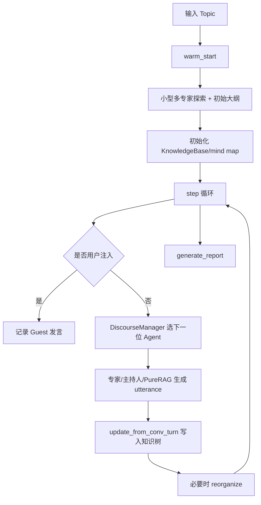

# STORM 项目全貌分析（自上而下）

## 1. 项目在做什么
`storm` 是一个“基于检索的长文生成与知识整理系统”，核心有两条产品线：

- **STORM**：先做研究（多视角问答+检索），再写文章（大纲->正文->润色）。
- **Co-STORM**：在 STORM 基础上加入多智能体协作与人机协同，维护一个动态知识树（mind map），支持逐轮讨论并最终生成报告。

一句话理解：
**它不是直接让 LLM 一次性写长文，而是把“调研->组织->写作”拆成可控流水线。**

---

## 2. 设计思想（为什么这么设计）

### 2.1 先检索再生成，降低幻觉
核心生成都尽量基于外部检索结果（`knowledge_storm/rm.py`）和引用片段，而不是仅靠参数知识。

### 2.2 多角色/多视角，提升覆盖面
- STORM：通过 persona 驱动的“写作者-专家”模拟对话扩大信息覆盖。
- Co-STORM：通过专家、主持人、用户的轮转策略避免讨论陷入单一视角。

### 2.3 强模块化，便于替换
项目将 **接口抽象**（`knowledge_storm/interface.py`）与 **具体实现**（`storm_wiki/modules/*`, `collaborative_storm/modules/*`）分离，LM 和检索器都可替换。

### 2.4 可观测与可复用
- 运行产物（对话日志、检索结果、大纲、引用映射、最终文章）都落盘。
- Co-STORM 还有结构化日志封装（`knowledge_storm/logging_wrapper.py`）。

---

## 3. 业务流程

## 3.1 STORM 主流程
入口：`knowledge_storm/storm_wiki/engine.py` 中 `STORMWikiRunner.run()`

关键模块对应：
- 阶段1：`knowledge_storm/storm_wiki/modules/knowledge_curation.py`
- 阶段2：`knowledge_storm/storm_wiki/modules/outline_generation.py`
- 阶段3：`knowledge_storm/storm_wiki/modules/article_generation.py`
- 阶段4：`knowledge_storm/storm_wiki/modules/article_polish.py`

## 3.2 Co-STORM 主流程
入口：`knowledge_storm/collaborative_storm/engine.py` 中 `CoStormRunner`

Co-STORM 的核心不是单次生成，而是：
- **回合策略**（`DiscourseManager.get_next_turn_policy`）
- **知识树持续更新**（`knowledge_storm/dataclass.py` 中 `KnowledgeBase`）
- **按需重组**（`KnowledgeBase.reorganize`）

---

## 4. 架构分层（代码组织）

## 4.1 分层视图

1. **抽象接口层**
- `knowledge_storm/interface.py`
- 定义 Engine、LMConfigs、Retriever、KnowledgeCurationModule、ArticleGenerationModule、Agent 等统一协议。

2. **引擎编排层**
- STORM：`knowledge_storm/storm_wiki/engine.py`
- Co-STORM：`knowledge_storm/collaborative_storm/engine.py`
- 负责串联阶段、控制参数、落盘产物、统计消耗。

3. **算法模块层**
- STORM 模块：`knowledge_storm/storm_wiki/modules/*`
- Co-STORM 模块：`knowledge_storm/collaborative_storm/modules/*`
- 负责问答、检索、知识插入、outline/report 生成等具体逻辑。

4. **模型/检索适配层**
- LLM：`knowledge_storm/lm.py`
- 检索器：`knowledge_storm/rm.py`
- 向量编码：`knowledge_storm/encoder.py`

5. **数据结构与工具层**
- `knowledge_storm/dataclass.py`（ConversationTurn/KnowledgeBase）
- `knowledge_storm/storm_wiki/modules/storm_dataclass.py`（StormInformationTable/StormArticle）
- `knowledge_storm/utils.py`

6. **应用与示例层**
- CLI 示例：`examples/storm_examples/*`, `examples/costorm_examples/*`
- 轻量前端：`frontend/demo_light/*`

---

## 5. 关键代码文件关系（入口到内核）

## 5.1 STORM 调用链
- 运行入口示例：`examples/storm_examples/run_storm_wiki_gpt.py`
- 创建配置：`STORMWikiLMConfigs` + `STORMWikiRunnerArguments`
- 引擎执行：`STORMWikiRunner.run()`
- 阶段模块：
  - 研究：`StormKnowledgeCurationModule`
  - 大纲：`StormOutlineGenerationModule`
  - 写作：`StormArticleGenerationModule`
  - 润色：`StormArticlePolishingModule`

## 5.2 Co-STORM 调用链
- 运行入口示例：`examples/costorm_examples/run_costorm_gpt.py`
- 创建配置：`CollaborativeStormLMConfigs` + `RunnerArgument`
- 引擎执行：`CoStormRunner.warm_start()` + `CoStormRunner.step()` + `generate_report()`
- 回合管理：`DiscourseManager`
- Agent 角色实现：`co_storm_agents.py`
- 知识树更新与重组：`KnowledgeBase` + `information_insertion_module.py`

## 5.3 前端调用链（Demo）
- UI 入口：`frontend/demo_light/storm.py`
- 页面：`frontend/demo_light/pages_util/CreateNewArticle.py`, `MyArticles.py`
- Runner 初始化与渲染辅助：`frontend/demo_light/demo_util.py`

---

## 6. 关键数据结构与产物

## 6.1 STORM
- `StormInformationTable`：聚合多 persona 对话中的检索信息。
- `StormArticle`：维护大纲树和统一引用映射。

输出目录（每个 topic）典型文件：
- `conversation_log.json`
- `raw_search_results.json`
- `direct_gen_outline.txt`
- `storm_gen_outline.txt`
- `storm_gen_article.txt`
- `url_to_info.json`
- `storm_gen_article_polished.txt`
- `run_config.json`
- `llm_call_history.jsonl`

## 6.2 Co-STORM
- `ConversationTurn`：一轮对话（角色、原始检索、引用信息等）。
- `KnowledgeNode`：知识树节点。
- `KnowledgeBase`：动态 mind map，支持插入、重组、报告生成。

常见输出：
- `report.md`
- `instance_dump.json`
- `log.json`

---

## 7. 项目调用的关键工具（技术栈）

- **DSPy**（`dspy_ai`）：
  - 声明式签名（`dspy.Signature`）
  - 组合模块（`dspy.Module`）
  - 预测链（`dspy.Predict`/`ChainOfThought`）

- **LiteLLM**（`knowledge_storm/lm.py`, `encoder.py`）：
  - 统一多模型供应商调用
  - 本地缓存（`~/.storm_local_cache`）
  - token 使用量统计

- **检索层**（`knowledge_storm/rm.py`）：
  - You/Bing/Serper/Brave/Tavily/DuckDuckGo/SearXNG/Azure AI Search
  - `VectorRM` 支持私有语料 RAG（Qdrant）

- **向量与相似度**：
  - 编码：`Encoder`（embedding）
  - 相似度：`sklearn` cosine similarity

- **网页抽取与文本处理**：
  - `trafilatura` + 自定义清洗逻辑

- **前端演示**：
  - Streamlit（`frontend/demo_light`）

---

## 8. 你可以如何快速接收这个项目

推荐按下面顺序阅读/运行：

1. 先看 `README.md`，建立 STORM 与 Co-STORM 的概念图。  
2. 直接看一个入口脚本：
   - STORM：`examples/storm_examples/run_storm_wiki_gpt.py`
   - Co-STORM：`examples/costorm_examples/run_costorm_gpt.py`
3. 再看引擎：
   - `knowledge_storm/storm_wiki/engine.py`
   - `knowledge_storm/collaborative_storm/engine.py`
4. 最后按模块下潜：
   - STORM 四模块
   - Co-STORM 的 `co_storm_agents.py` + `information_insertion_module.py` + `warmstart_hierarchical_chat.py`

如果你的目标是“先跑通再改造”，建议先从 STORM 入手，因为它是线性四阶段流水线，认知成本更低；再进入 Co-STORM 的多角色回合管理。
